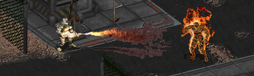

Improved Death Animations - Animation Fix
-----------------

This mod changes the image size of the "flame boy" and "electorcuted" death animation for super mutants (120%) and power armor (larger than normal, but smaller than mutant-size) critters.

The original mod was by .Pixote. and Sduibek. With this mod release, the animations have been polished up some more and are now much more clean and less pixelated.

To use this mod, open the ddraw.ini and add "PatchFile1=mods\Anim_ImprovedSMutantDeath" under the "PatchFile0"-line!
The game will now load the additional mod folder.

If there is more than one additional mod, make sure to correctly number the "PatchFileX" entry (1, 2, 3, ...).
