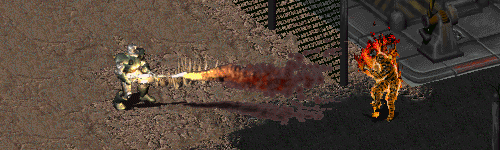

Increased Flameboy - Animation Fix
-----------------

This mod changes the frame size of the "flame boy" death animation for super mutants (120%) and power armor (larger than normal, but smaller than mutant-size) critters.

Made by .Pixote. and Sduibek.

To use this mod, open the ddraw.ini and add "PatchFile1=mods\Anim_IncreasedFlameboy" under the "PatchFile0"-line!
The game will now load the additional mod folder.

If there is more than one additional mod, make sure to correctly number the "PatchFileX" entry (1, 2, 3, ...).
