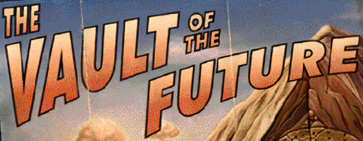

Interface Upscaled
------------------

## Features:
- Higher resolution Town/World graphics for FALLOUT ET TU and vanilla FALLOUT 2.
- Higher resolution endgame slides for FALLOUT ET TU and vanilla FALLOUT 2.
- Higher resolution death screen (the FALLOUT 2 graphic is in /INTRFACE/Fallout2/ and must be manually moved into the /INTRFACE/ folder of this mod).
- Higher resolution splash screens (the FALLOUT 2 graphics are in /SPLASH/Fallout2/ and must be manually moved into the /SPLASH/ folder of this mod).
- Works with any other FALLOUT 2 mod (eg. Restoration Project).

## NOTE:
"ExpandWorldMap" in the ddraw.ini file must be set to 1 and the game has to run in a minimum resolution of 890x720px, otherwise the game will crash. Keep in mind that using the SCALE_2X option of the High-Res patch means the effective resolution is halved! 

### Installation
To use this mod, add the mod folder name to the mods_order.txt file inside the /mods/ directory. If the mods_order.txt doesn't exist, start the game once for it to be created.