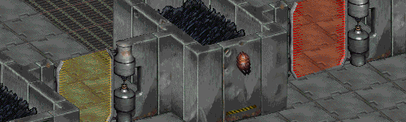

Fallout 1 Alternative Force Fields  
-----------------

Created by .Pixote. for Mutants Rising, this small mod will replace the vanilla yellow and red force fields with new, animated graphics.

### Installation
To use this mod, add the mod folder name to the mods_order.txt file inside the /mods/ directory. If the mods_order.txt doesn't exist, start the game once for it to be created.
