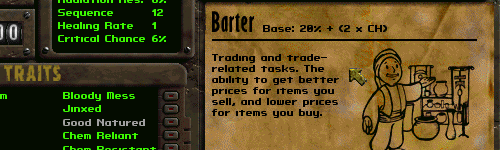

Fallout 1 Barter Formula
--------------------------

This mod reverts the barter formula and prices on merchants to the ones from FALLOUT 1.

### Installation
To use this mod, open the ddraw.ini, go to [ExtraPatches] and add "PatchFile[number]=mods\fo1_barter_formula" at the end of the "PatchFile"-list!
The game will now load the additional mod folder.

If there is more than one additional mod, make sure to correctly number the "PatchFileX" entry (1, 2, 3, ...).
