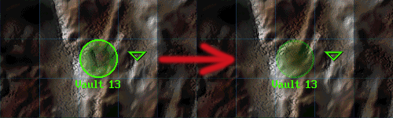

Fallout 1 Classic Worldmap
--------------------------

This mod replaces Fallout 2's green circles, as well as the 
worldmap tiles with city locations to bring the game's look
more in line with the original Fallout 1. 

To use this mod, open the ddraw.ini and add "PatchFile1=mods\fo1_classic_worldmap" under the "PatchFile0"-line! The game will now load the additional mod folder.

If there is more than one additional mod, make sure to correctly number the "PatchFileX" entry (1, 2, 3, ...).