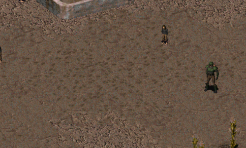

Fallout 1 Footprints
-----------------

Prototype mod. Humans will leave footprints in soft sand when moving around. Currently only compatible with FALLOUT ET TU.

### Installation
To use this mod, open the ddraw.ini, go to [ExtraPatches] and add "PatchFile[number]=mods\fo1_footprints" at the end of the "PatchFile"-list!
The game will now load the additional mod folder.

If there is more than one additional mod, make sure to correctly number the "PatchFileX" entry (1, 2, 3, ...).
