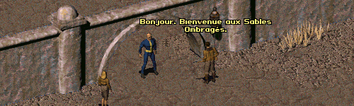

Fallout 1 Language Pack - French / Français
------------------

La version française de FALLOUT ET TU.

Le jeu peut se jouer entièrement en français. Pour toute question ou correction, vous pouvez contacter l'équipe de Fallout Génération à l'adresse : http://www.fallout-generation.com

### Installation
Pour utiliser ce mod allez dans le 'fallout2.cfg' et modifiez la ligne : 'language=french'

Dans le 'ddraw.ini', allez à la section [ExtraPatches] et ajoutez la ligne :
"PatchFile[nombre]=mods\fo1_french" à la fin de la liste du "PatchFile" !
Le jeu charge les mods dans l'ordre de la liste.

If there is more than one additional mod, make sure to correctly number the "PatchFileX" entry (1, 
2, 3, ...).
