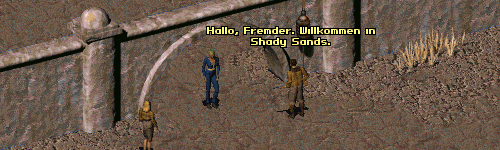

Fallout 1 Language Pack - German / Deutsch
------------------

Die deutsche Übersetzung von FALLOUT ET TU.

Das Spiel sollte komplett auf Deutsch spielbar sein. Falls sich doch noch die ein oder anderen englischen Passagen finden lassen,
ist jede Hilfe bei der Fertigstellung der Übersetzung willkommen!

### Installation
Zuerst sollte sichergestellt sein, dass in `fallout2.cfg` die Sprache auf Deutsch eingestellt ist (`language=german`).
Öffne dann die `ddraw.ini`, gehe zu `[ExtraPatches]` und füge `PatchFile[number]=mods\fo1_german` ans Ende der `PatchFile`-Liste!
Das Spiel wird dann die Mod laden.

Falls mehr als eine Mod geladen wird, muss darauf geachtet werden, dass `PatchFileX` korrekt nummeriert wird (1, 2, 3, ...).
