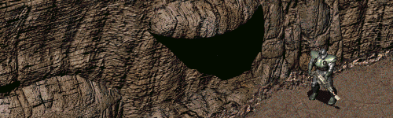

Fallout 1 Maps - Mountains
--------------------------

The original mountain encounter maps were made for a resolution of 640x480px. This mod increases the visible area of the mountain encounter maps to support a resolution of 1280x720px without showing black bars at the top and bottom of the screen. Running the game in even higher resolutions will have visible black bars again, just not as big as originally. 

### Installation
To use this mod, add the mod folder name to the mods_order.txt file inside the /mods/ directory. If the mods_order.txt doesn't exist, start the game once for it to be created.