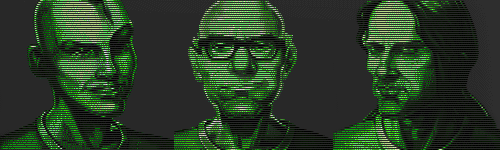

Fallout 1 New Premade Characters
--------------------------------

Replaces the original FALLOUT 1 premade characters. Depending on the picked character, the starting items will change.

##### PERSONAL BIO DATA:
**Kenneth** - Known and feared as an explosives expert, Kenneth Glade always felt restricted by the Vault's confined environments. The feeling intensified after he was banned from further experiments after nearly blowing up the Vault's hydroponics. The Overseer may be trying to get rid of Ken and set him loose for the safety of the Vault. Ken doesn't mind, he's looking forward to new proving grounds for his devices.

**Louis** - Louis Krawczuk is a misanthrope and one of the Vault's most accomplished medical professionals. Early onset of baldness and myopia made him stand out in the crowds, making him seek adventure alone in the underbelly of the Vault. He hopes that by leaving the Vault he'll force his peers to respect him, and more importantly, get away from the sneers of model citizens who never gave him a fair chance.

**Sarah** - Sarah Asturias worked with electricity all her life, from the young age of three. A freak accident with a power conduit left her with loss of motor control in the left hand, but it never stopped her: She studied and practised until she became a master with her right hand, whether it be tools or pistols. With a knack for picking up skills and developing them, she is eager to put them to test outside the Vault.

### Installation
To use this mod, open the ddraw.ini, go to [ExtraPatches] and add "PatchFile[number]=mods\fo1_newPremades" at the end of the "PatchFile"-list!
The game will now load the additional mod folder.

If there is more than one additional mod, make sure to correctly number the "PatchFileX" entry (1, 2, 3, ...).
