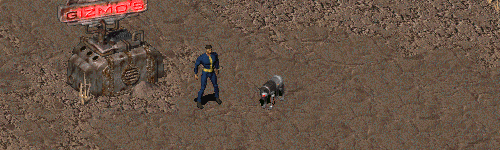

Fallout 1 Robodog
-----------------

This is a small just-for-fun mod that turns Dogmeat into a Robodog.

To use this mod, open the ddraw.ini and add "PatchFile1=mods\fo1_robodog" under the "PatchFile0"-line!
The game will now load the additional mod folder.

If there is more than one additional mod, make sure to correctly number the "PatchFileX" entry (1, 2, 3, ...).
