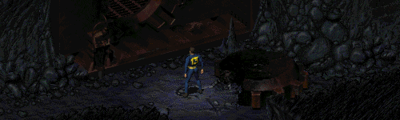

Fallout 1 - Vault 15 Rework
-----------------

This mod changes the Vault 15 entrance maps to be more in line with the Vault 15 design in FALLOUT 2. Ideas from both games were merged together to create a new, lore friendly blend (80 years before Fo2 begins), without changing the actual gameplay of the location.

### Installation
To use this mod, open the ddraw.ini, go to [ExtraPatches] and add "PatchFile[number]=mods\fo1_v15_rework" at the end of the "PatchFile"-list!
The game will now load the additional mod folder.

If there is more than one additional mod, make sure to correctly number the "PatchFileX" entry (1, 2, 3, ...).
