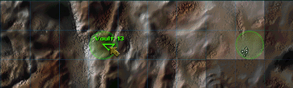

Fallout 1 Classic Worldmap
--------------------------

This mod replaces FALLOUT 2's native green circles, as well as the worldmap tiles with city locations to bring the game's look more in line with the original FALLOUT 1. 

### Installation
To use this mod, open the ddraw.ini, go to [ExtraPatches] and add "PatchFile[number]=mods\fo1_classic_worldmap" at the end of the "PatchFile"-list!
The game will now load the additional mod folder.

If there is more than one additional mod, make sure to correctly number the "PatchFileX" entry (1, 2, 3, ...).
